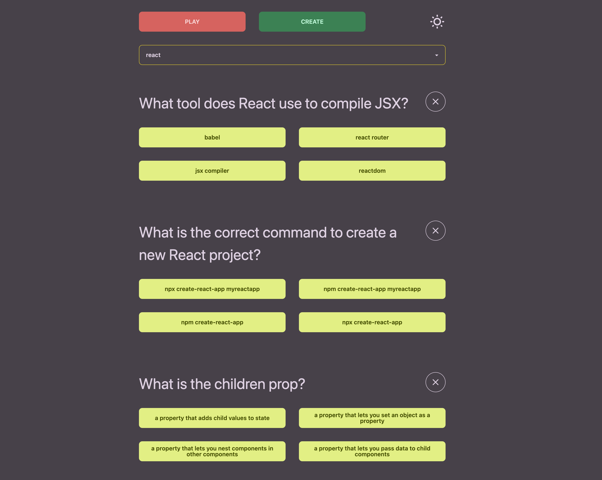
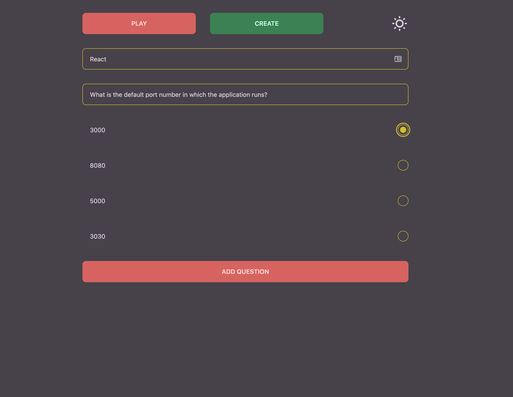

# QuizMate

QuizMate lets users prepare multiple-choice quizzes. It can be used to revise for a test, practise vocabulary, or even just do a quiz for fun.

Users make their own quizzes in the ‘create’ section, adding questions with four possible answers. In the ‘play’ section, users select the category of quiz they want to play and go through the questions. Users can easily add new questions to a category, delete questions, and create new categories.

## ​​Getting Started

- Clone the repo
- Install npm packages with `npm i` in both root and server folder
- Change directory to `/server` and run `npm run start`
- Change directory back to root and run `npm run start` to launch application in the browser

## Tech Stack

React, Node.js, Express.js, MongoDB, Tailwind CSS

